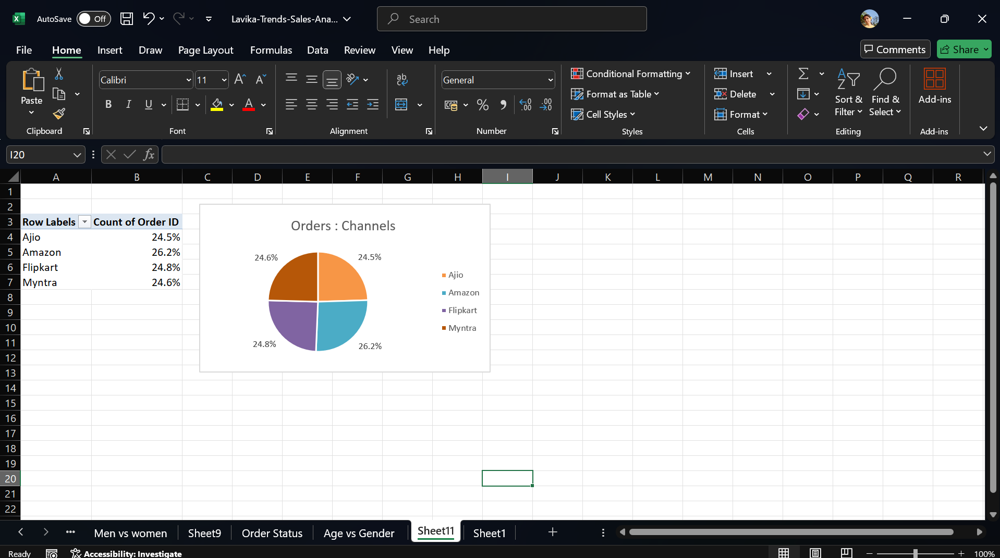

# Lavika Trends Sales Analysis

## Project Overview

This project is a comprehensive analysis of the 2022 sales data for Lavika Trends, an e-commerce clothing retailer. The goal of this analysis is to uncover sales trends, understand customer behavior, and identify opportunities for business growth. This project showcases skills in data cleaning, analysis, and visualization using Microsoft Excel.

---

## Tools Used

- **Microsoft Excel**: For data cleaning, processing, pivot tables, and creating visualizations.

---

## Analysis & Visualizations

**1. Monthly Sales Trend**

**2. Sales by Gender**

**3. Age vs. Gender Distribution**
*(Note: You still need to upload the screenshot for this chart to the 'images' folder and name it 'age_vs_gender.png' for it to appear)*
 

**4. Top 5 States by Sales**

**5. Order Status Distribution**

**6. Sales by Channel**

**7. Interactive Dashboard Demo**

*This GIF demonstrates the interactive dashboard built in Excel. The slicer allows for a dynamic view of sales channel performance for any given month.*

---

## Key Insights & Recommendations

Based on the analysis, here are the key findings from the data:

- **Peak Sales Month**: The month of **March** generated the highest sales revenue. The business should plan for higher inventory and targeted marketing campaigns during this peak period.

- **Gender Demographics**: **Men** are the higher-spending customers. Marketing efforts could include campaigns targeted specifically towards the male demographic.

- **Primary Customer Segment**: The **"Adult" Men** group (ages 31-50) is the most valuable customer segment. Marketing content and product selection should be tailored to this group's preferences.

- **Top Performing States**: The top three states by sales are **Maharashtra, Karnataka, and Uttar Pradesh**. The company should focus marketing spend and logistical resources in these key regions to maximize ROI.

- **Operational Improvement Area**: The data shows a high number of **Cancelled** orders. The business should investigate the reasons for cancellation to improve operational efficiency and customer satisfaction.

---
